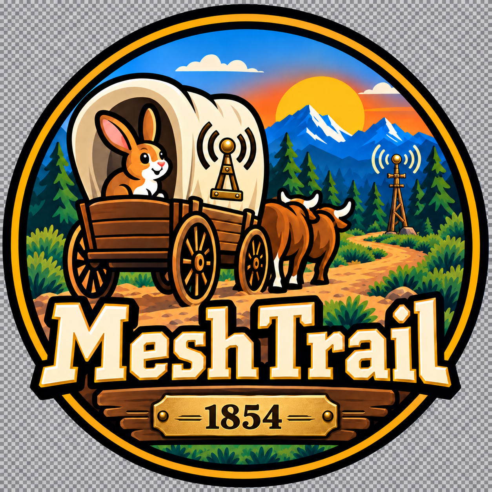

# MeshTrail



MeshTrail is an original, Oregon Trail-inspired survival game made for short MeshCore direct
messages. It is set in 1854 with a light alternate-history twist: wagon parties carry experimental
Long-Range (LoRa) Aether Telegraphs linked by fort relay masts. It runs as an isolated native
openHop service plugin, using the same Companion TCP integration pattern proven by MeshZork.

At Fort Kearny, players may discover that the local relay is maintained by the volunteer
Nebraska Mesh Telegraph Cooperative—a period-flavored Easter egg honoring
[NebraskaMesh.net](https://www.nebraskamesh.net/).

The openHop rabbit also appears as a brass seal on each telegraph set and as a mysterious white
jackrabbit near significant relay stations.

The plugin logo carries the same story visually: the rabbit rides in the covered wagon, its
canvas bears the brass Aether Telegraph emblem, a relay mast stands beside the trail, and a
centered 1854 plate anchors the badge.

This is not a copy or port of the commercial Oregon Trail game. The code, simulation, events,
and writing in this repository are original.

## First playable slice

For a beginner-friendly walkthrough, see [PLAYER_GUIDE.md](PLAYER_GUIDE.md).

Each sender prefix gets an independent SQLite-backed wagon party. Send one command per DM:

- `START` - create a new party
- `GO` - travel for seven days
- `STATUS` or `SUPPLIES` - inspect the journey
- `PING` - inspect galvanic cells, aerial condition, and the next relay
- `BEACON` - spend cell power to request a trail report from the prairie mesh
- `HUNT` - spend ammunition and two days to gain food
- `REST` - spend food and three days to recover health
- `PACE steady|strenuous|grueling`
- `RATIONS filling|meager|bare`
- `FORD`, `CAULK`, or `FERRY` - resolve a river crossing when the trail reaches one
- `RESET` - abandon the current run and start over
- `HELP` - show the command list

Travel events are repeatable for a given player, turn, and configured seed. MeshCore delivery
retries are deduplicated so the same radio message cannot advance a party twice.
The Kansas, Big Blue, South Platte, Green, Snake, and Columbia rivers interrupt travel with
persistent choices; a lost or delayed reply cannot silently skip the decision. In Nebraska,
travelers also join and follow the Great Platte River Road before reaching the South Platte ford.

See [GAME_DESIGN.md](GAME_DESIGN.md) for the historical/mesh tone and future multiplayer ideas.

## Development

Python 3.12 or newer is required.

```bash
python -m venv .venv
.venv/bin/pip install -e '.[dev]'
.venv/bin/pytest
.venv/bin/ruff check .
python -m build
```

On Windows, use `.venv\Scripts\python` and `.venv\Scripts\pytest`.

## openHop installation

Build the wheel with `python -m build`, then install the resulting wheel through openHop's
plugin manager using the same wheel-install workflow used for MeshZork. The manifest installs
under plugin ID `openhop.meshtrail`, and the service entrypoint is `meshtrail-openhop`.

The default connection is `127.0.0.1:5003`. Runtime data is stored in
`$OPENHOP_PLUGIN_DATA/meshtrail.sqlite3`. Configuration can be changed in the plugin's
settings page, in `config.json`, or with matching uppercase environment variables.

Open MeshTrail from the openHop Plugins page to set the maximum number of simultaneous players
and the idle timeout. An idle player releases their active slot after the configured interval,
but their SQLite-backed journey remains saved. The defaults are three active players and a
15-minute timeout.

MeshTrail uses port `5003` so it can coexist with a MeshZork Companion on `5002`. Give each
plugin its own Companion identity; a Companion accepts only one connected TCP client.

## Docker-based openHop

MeshTrail is installed into openHop's existing container through the plugin manager. It does not
need a second application container. Use a plugin-capable `openhop/openhop-repeater` image and
keep these openHop paths on named volumes or bind mounts:

```yaml
volumes:
  - openhop-repeater-config:/etc/openhop_repeater
  - openhop-repeater-data:/var/lib/openhop_repeater
```

Do not disable the container's plugin manager with `OPENHOP_PLUGIN_MANAGER=0`, and do not install
systemd inside the container. The openHop entrypoint supervises both the repeater and plugin
manager.

Create a dedicated Companion identity in openHop with these settings:

```yaml
identities:
  companions:
    - name: "MeshTrail"
      identity_key: "YOUR_OPENHOP_GENERATED_PRIVATE_IDENTITY_KEY"
      settings:
        node_name: "MeshTrail"
        bind_address: "127.0.0.1"
        tcp_port: 5003
        tcp_timeout: 0
```

Upload and enable the MeshTrail wheel through the openHop Plugins page. Because the plugin runs
inside the same container, `127.0.0.1:5003` is correct and the Companion port does not need to be
published by Compose. SQLite saves live below `/var/lib/openhop_repeater/plugins/` and survive
container replacement when the data volume is persistent.

The repository includes `tests/Dockerfile.smoke`. CI builds the wheel in clean
`python:3.12-slim`, installs it with dependencies, checks the packaged logo, plays through the
first river crossing, and reopens the SQLite save from a new game instance.

## Safety and isolation

The plugin is a supervised child process. A crash or invalid game command cannot replace or
stop the openHop repeater. The client reconnects with bounded backoff if the Companion TCP
connection is interrupted.

